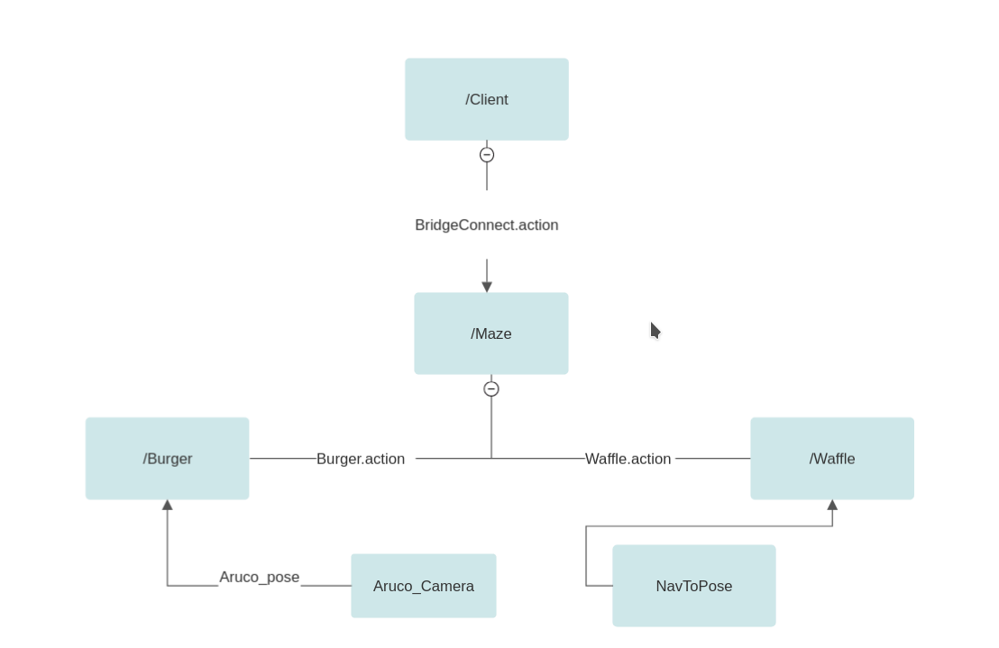
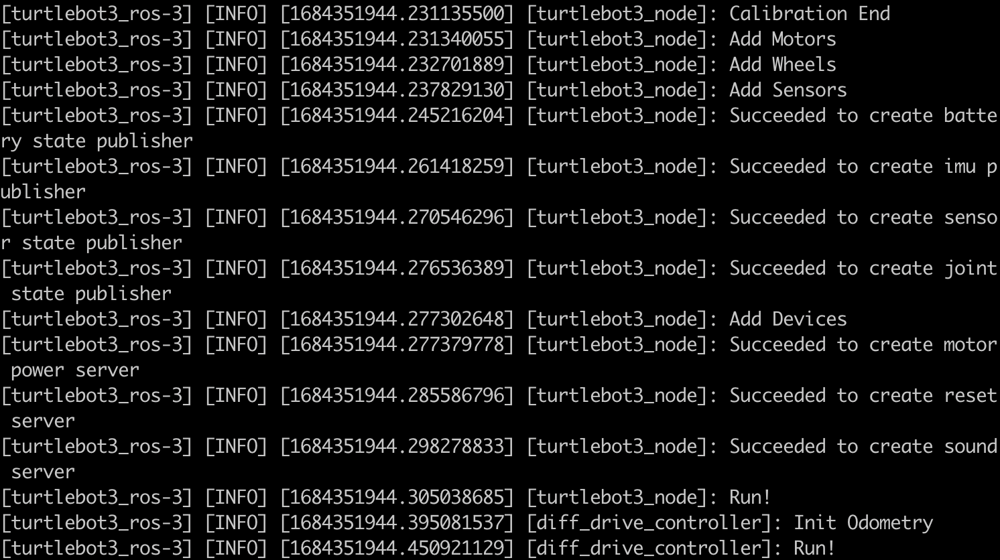
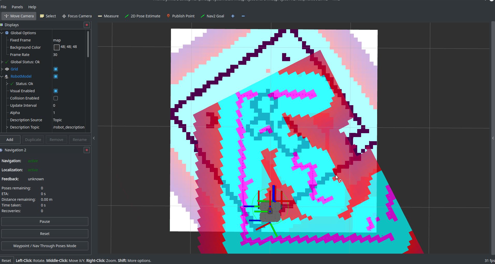
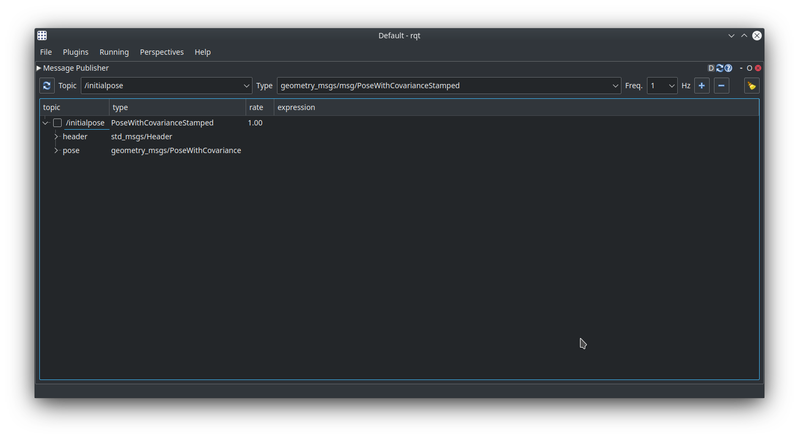
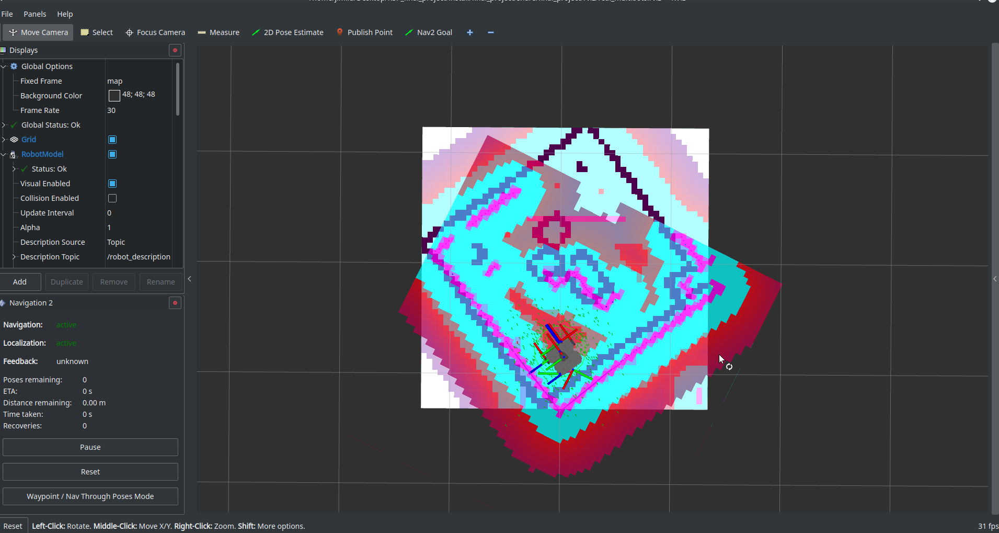

# Turtlebot Teaming 

## Objective 

This project shows how two turtlebots can cooperate with each other to finish a task.

- Turtlebot3 Burger: The Burger bot wants to go to a target destination on a platform. However, it has to pass through a gap to achieve that. As soon as Burger reaches the gap, it request Waffle for help, wait until Waffle sucessfully finishes its task and continues driving to reach its destination.
- Turtlebot3 Waffle: The Waffle bot stays on the ground until it receives a “help” message from Burger. Then, it will navigate to the gap, push the box to fill the gap, and will drive back to its starting position.

## System Requirements

### For Simulation  
- Ubuntu Linux-Focal Fossa(20.04)
- [Gazebo Fortress](https://gazebosim.org/docs)
- [ROS2 galactic](https://docs.ros.org/en/galactic/Installation/Alternatives/Ubuntu-Development-Setup.html)

### For real robots
This project uses a Raspberry Pi 4B, Turtlebot3 Burger, Turtlebot3 Waffle and USB camera. To setup the real bots using Raspberry Pi follow the instructions [here](https://emanual.robotis.com/docs/en/platform/turtlebot3/sbc_setup/#sbc-setup)

## Installation
### vcs
Follow the instructions [here](https://github.com/dirk-thomas/vcstool) to install vcs. Pleae install `vcs` on your PC, waffle, and burger.

### rosdep
Install rosdep 0.22.2 by 
```
pip install rosdep
```
Pleae install `rosdep` on your PC, waffle, and burger.

### ros2_aruco
This package is required for both PC and burger. The package will be installed by our `.repos` file. However, it requires you to have `opencv` with version greater than `4.7` installed on your system. Please check your opencv version! If you don't have opencv installed, use the following command.
```
pip install opencv-contrib-python
```
MAKE SURE you installed the `contrib` verion. If you install `opencv-python`, it WON'T work!

### Turtlebot3 PC Setup Requirements
Here are some essential packages that needs to be installed on your PC (NOT ON Waffle or Burger!).

1.  Install Cartographer
    
        sudo apt install ros-<ros2-distro>-cartographer
        sudo apt install ros-<ros2-distro>-cartographer-ros
2.  Install Navigation2
    
        sudo apt install ros-<ros2-distro>-navigation2
        sudo apt install ros-<ros2-distro>-nav2-bringup
3.  Install additional Turtlebot3 packages
    
        sudo apt install ros-<ros2-distro>-dynamixel-sdk
        sudo apt install ros-<ros2-distro>-turtlebot3-msgs
        sudo apt install ros-<ros2-distro>-turtlebot3
        
4.  ROS2 ignition integration. In case you don't have these packages,
    
        sudo apt install ros-<ros2-distro>-ros-ign-gazebo
        sudo apt install ros-<ros2-distro>-ros-ign-bridge
        
6.  xterm. If you don't have xterm installed on your ubuntu system, please install it.
    
        sudo apt install xterm -y
        
### Build your workspace on your PC
- Build your own workspace and clone the repository.
- Under your workspace, make a new directory `src`.
- Go to the `src` folder you just created and clone this repository
```
cd src/
git clone https://github.com/Mixmorks/RSP_final_project.git
```
  Now, you should have a `RSP_final_project` folder under your `src` folder.
- Install the necessary packages and dependencies with following commands
``` 
vcs import < RSP_final_project/final_project/PC.repos
cd ..
rosdep install --from-paths src --ignore-src -r -y
colcon build
```

### Build your waffle
To run our project, you need to download and compile some additional packages. After you follow the instructions from the turtlebot3 website, you should have a workspace called `turtlebot3_ws`. Clone the `waffle-foxy` branch from our repository to the `src` folder and build the whole packages as instructed below.
``` 
cd ~/turtlebot_3/src
git clone -b waffle-foxy https://github.com/Mixmorks/RSP_final_project.git
vcs import < RSP_final_project/final_project/waffle.repos
cd ~/turtlebot_3
rosdep install --from-paths src --ignore-src -r -y
colcon build
```


### Build your burger
To run our project, you need to download and compile some additional packages. After you follow the instructions from the turtlebot3 website, you should have a workspace called `turtlebot3_ws`. Clone the `burger-foxy` branch from our repository to the `src` folder and build the whole packages as instructed below.
``` 
cd ~/turtlebot_3/src
git clone -b burger-foxy https://github.com/Mixmorks/RSP_final_project.git
vcs import < RSP_final_project/final_project/burger.repos
cd ~/turtlebot_3
rosdep install --from-paths src --ignore-src -r -y
colcon build
```

# Package Info


## `final_project`

This package contains the main launch files that are used to launch simulation in ignition gazebo  or to control the real robots. The `urdf` folder contains all xacro files used to spawn waffle and burger in ignition gazebo. Note that you will not need these urdfs files for the real robots.  The config files that nav2 uses are located in `param` folder. By default, `waffle.yaml` is used for simulation and `waffle_real.yaml` is used to navigate the real Waffle. `rviz` file has all the rviz configurations used for the simulations and real robots. All map files are stored in `map` folder. If you want to create your own map, we suggest you to store your map files under this folder. 
There are four launch files you will use to run our projet. 
For simulation:
- `simulation_draw_map.launch`
  This launch file will create our simulation world in ignition gazebo and spawn a waffle in this world. It will also open up the rviz so that you can visualize the waffle and the world it is sensing via its lidar sensor. An external terminal will also be launched allowing users to drive the waffle around in this world. The SLAM toolbox will update the map periodically.
- `maze_action_simulation.launch`
  This launch file will spawn both waffle and burger in our simulation world and open up the rviz to show you the movement of waffle. Note that the rviz does not display burger in it. Spawning two turtletbots may be troublesome if you don't do the followings correctly!
  1. Remap `/robot_description` topic correctly so that both robots will not publish their urdf message to the same topic. You can do this either via namespace or hard code their `/robot_description` topics to different names.
  2. Remap `/odom` topic correctly so that both robots will not publish their odometry readings to the same topic. You can do this either via namespace or hard code their `/odom` topics to different names.
  3. Using `frame_prefix` parameter to add a prefix to robots' links. Since both waffle and burger have same link names. Without `frame_prefix`, the `/tf` topic cannot distinguish which frames belong to waffle and those belong to burger. As a result, the Nav2 package will have a problem about robot's localization. The `frame_prefix` is a ROS parameter of the `robot_state_publisher` package.
  4. Right now, only waffle is controlled by Nav2. If you wish to control multiple robots via Nav2, you have to do the above correctly and change each robot's odom `frame_id` to different names.
For real robots:
- `turtlebot_draw_map.launch`
  Similar to `simulation_draw_map.launch`, this launch file will open up both rviz and an external terminal that allows users to drive around a real waffle robot in their real world environments.
- `real_world_multibots.launch`
  Simular to `simulation_multibots.launch`, this launch file is used in our *Waffle-burger cooperation task*.

## `ign_gazebo`

This package contains meshes and models for the Aruco AR markers and entities in the world for ignition gazebo simulation. You can change the world by changing the `bot_world.xacro` in `urdf` file. You can add your own markers by importing the meshes and models into this package.   

## `maze_msgs`

All the source files required to run the actions that enable this team task are located in [this package](https://github.com/Mixmorks/RSP_final_project/tree/main/maze_msgs). This package has an `action` directory that contains the goal, result and feedback information for all the actions used for the project. 


## `navtopose`

The navtopose package can be used to send a target location to waffle. There are two ways to set a goal pose through nav2 - one is to use the Nav2Goal option in Rviz while running the simulation and the second one is to utilize this package to set the goal.

## `turtlebot_actionlib`

The turtblebot_actionlib package contains multiple action servers and clients that execute the actions in `maze_msgs`. It has three nodes: 'maze', 'waffle',and 'burger',and their relationship shown in [action diagram](./docs/action_diagrampng.png). To run the simulation and real robot separately, what you need to do is tuning the parameters in . 


# Simulation
## Mapping 

SLAM toolbox was used to create the map. Follow the instructions in this section to generate a map. 

1.  Run the `simulation_draw_map.launch` file in a new terminal.
    
        cd <YOUR/WORKSPACE>
        source install/setup.bash
        ros2 launch final_project simulation_draw_map.launch
    
This launch file will start up rviz and use waffle&rsquo;s lidar data to create a map. It also starts up a teleop node that allows users to drive around in their simualtion world. The map will update periodically in rviz while the waffle is moving.
    
2.  Save the map. Open a brand new terminal and run the map saver command.
    
        ros2 run nav2_map_server map_saver_cli -f <path/to/save/your/map>
    
This command saves map files to a user defined path. For example, if you want to save the map files under you home directory. You can run
    
        ros2 run nav2_map_server map_saver_cli -f ~/map

Note: The map saver command saves two files on your PC. You can visualize your map in &ldquo;map.pgm&rdquo;. The &ldquo;map.yaml&rdquo; file contains some parameters and the path to your &ldquo;map.pgm&rdquo; file. If you want to load your map into rviz, you might want to change your &ldquo;pgm&rdquo; file&rsquo;s path in the &ldquo;yaml&rdquo; file so that rviz can find and load your map correctly. You can `Ctrl+C` to stop the `simulation_draw_map.launch` that is running once you save the map. 

## Visualize the teaming on ignition gazebo and rviz

1.  To launch the simulation with predefined worlds and parameter, you can 
    
        cd <YOUR/WORKSPACE>
        source install/setup.bash
        ros2 launch final_project maze_action_simulation.launch

2.  Open a new terminal and run the following command. This command initiates the process of Burger driving, and starts communication between the two bots.
    
        cd <YOUR/WORKSPACE>
        source install/setup.bash
        ros2 run turtlebot_actionlib sim_client
        
Map and Waffle in Rviz     |  Bots in Ignition Gazebo
:-------------------------:|:-------------------------:
 |  

The lidar on Waffle scans the world to create a map and localize itself. Whereas Burger scans the Aruco AR markers using its camera to localize itself.  
        
 


3. Burger localization depends on the `ros2_aruco` package. This package locates Aruco AR markers in images and publishes their ids and poses. 
- Node `aruco_node`
- Subscribes to 
    `/camera/image_raw`
    `/camera/camera_info` 
- Publishes 
    `/aruco_poses` 
    `/aruco_markers`
`/aruco_markers` gives the pose of the AR tag relative to the camera link on Burger bot. 

4. Nav2 helps us to localize and navigate waffle. The most important two things that related to our task are
   - initial pose
     - For simulation, the param file, [waffle.yaml](https://github.com/Mixmorks/RSP_final_project/blob/main/final_project/param/waffle.yaml), has initial pose variables that allows users to give their own initial pose estimation. Alternatively, users can also use rviz to do it. Click the `2D Pose Estimate` button in the Rviz2 menu. Then, click on the map where the actual robot is located and drag the large green arrow towards the direction where the robot is facing.
     - For real robots, you can use `rqt` gui as detaied in *Waffle-burger cooperation task* section.
   - sending goals to nav2
     In our project, we used `navtopose` package to send goal requests to nav2. The goal position was sent by the `robot_client` of the `turtlebot_actionlib` package. Alternatively, you can use rviz to set the goal. First, click the 'Nav2Goal' button in the Rviz2 menu. Then, similar to setting the initial pose in rviz, you need to click on the map to set the desired position of the robot and drag the green arrow such that it faces the desired orientation.

## Troubleshooting

1. If the simulation does not start automatically once you launch `maze_action_simulation.launch`, click on the hamburger icon on the right corner of the ignition gazebo window and search for 'Image display'. Once you scroll down this panel you should be able to see what Burger's camera is seeing. Make sure that you see the AR tag. To verify this you can echo `/burger_camera` topic to see Burger's camera is sending out images. In another terminal echo `/aruco_markers` to see if the AR tag is being detected. If Burger's camera is running, `/aruco_markers` should work. If the frame rate of `/burger_camera` is too slow, then it was found that `/aruco_markers` does not echo anything.

# On the real bots 
## Mapping the environment
Please drive waffle through the environment to create a 2D map!
1. ssh into waffle.
2. On waffle, run
    
        ros2 launch final_project waffle_setup.launch.py

3. On your PC, start the SLAM node by
    
        ros2 launch final_project turtlebot_draw_map.launch

4. To save your map, run
    
        ros2 run nav2_map_server map_saver_cli -f <path/to/save/your/map>
    
You can close all the terminals after your map is saved!

## Waffle-burger cooperation task
Before start the task, we have made some additional modifications to burger so that two robots can work simultaneously.
- Add frame_prefix.
  Under `turtlebot3_ws`, there is a `turtlebot3_state_publisher.launch.py` file in the `turtlebot3_bringup` package, we changed `parameters=[rsp_params, {'use_sim_time': use_sim_time}],` -> `parameters=[rsp_params, {'use_sim_time': use_sim_time}, {'frame_prefix': 'burger/'}]`,
- Change `odom`'s `frame_id` and `child_frame_id`.
  We modified the `burger.yaml` located in `turtlebot3_bringup/param`. The `frame_id` is changed to `"burger/odom"`, and the `child_frame_id` is changed to `"burger/base_footprint"`.

1. Setting up waffle and burger. 
   On your PC, open a terminal and ssh to waffle. Then run,
    
        ros2 launch final_project waffle_setup.launch.py

   On your PC, open another terminal and ssh to burger. Then run,
    
        ros2 launch final_project burger_setup.launch.py

   Note: it is common to have errors related to the `v4l2` package on burger. This package deals with Logitech Webcam, since the default Raspberry Pi Camera module did not work for Ubuntu 20.04! Once everything is up and running, you should see something similar to the screenshot below.
 
2. On your PC, open up a terminal and run the `real_world_multibots.launch` file.
   Go to your workspace and source the corresponding `.sh` file.
    
        cd <YOUR/WORKSPACE>
        source install/setup.bash

   Then,
    
        ros2 launch final_project real_world_multibots.launch

3. Before you correctly give it a initial pose estimation, the map sensed by waffle may not overlap with the map you created previously like the figure shown below.
 
   
   You will need `rqt` gui to set initial pose. Open up a new terminal, and then type
    
        rqt

   The following window will show up.
 

   Then under `Plugin` tab, select `Topics` > `Message Publisher`. Then in the drop down menu of `Topic`, select `/initialpose`. Its type is set to `geometry_msgs/msg/PointWithCovarianceStamped` by default. By clicking the `+` button, you can edit the pose and covriance and enter the initial pose esitmation and the covariance. To run our task for our specific map, we suggest you to enter the following values to the initial pose.
   - Under `header`, change `frame_id` to `'map'`;
   - Under `pose` > `pose` > `position`, change `x` to `0.152`, `y` to `-0.0101`;
   - Under `pose` > `pose` > `orientation`, change `z` to `0.315`, `w` to `0.949`;
   - Under `pose` > `covariance`, change `[0]` to `0.05`, `[7]` to `0.05`, `[35]` to `0.05`.
   
   After you enter the initial pose and covariance, check the box in front of the `/initialpose`, to publish it. Then, in rviz, your waffle's sensed map will overlap with the loaded map and you'll be able to see the paricles around the robot from the Monte Carlo localization that Nav2 does. Now, you can uncheck the box in `rqt` to stop publishing it. If the particles seem too dispersed you can play around with the values of covariances for x, y, yaw. NOTE: it is crucial to stop publishing the initial pose before you run the following commands!
 


**Optional**  
Intead of open rqt, you can run the `initialpose_pub` node to publish the initial pose. 
```
        cd <YOUR/WORKSPACE>
        source install/setup.bash
        ros2 run turtlebot_actionlib initialpose_pub
```
Note: Ctrl+C the terminal after rviz received the initial pose.

4. Open a new terminal to run server.
    
        cd <YOUR/WORKSPACE>
        source install/setup.bash
        ros2 run turtlebot_actionlib server

5. Open a new terminal to run robot client.
    
        cd <YOUR/WORKSPACE>
        source install/setup.bash
        ros2 run turtlebot_actionlib robot_client

Then you will see waffle and burger cooperating with each other to finish task!
Here is the YouTube Link of our .
   
   

