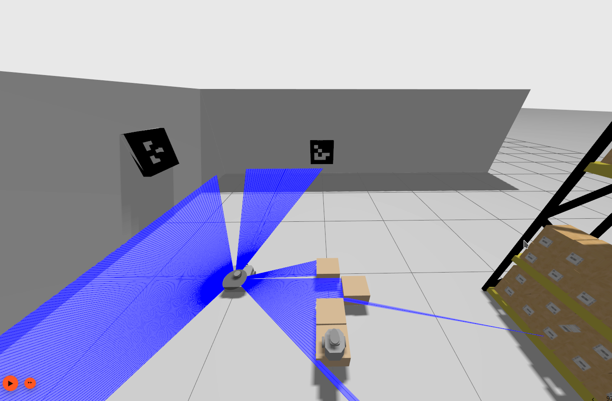
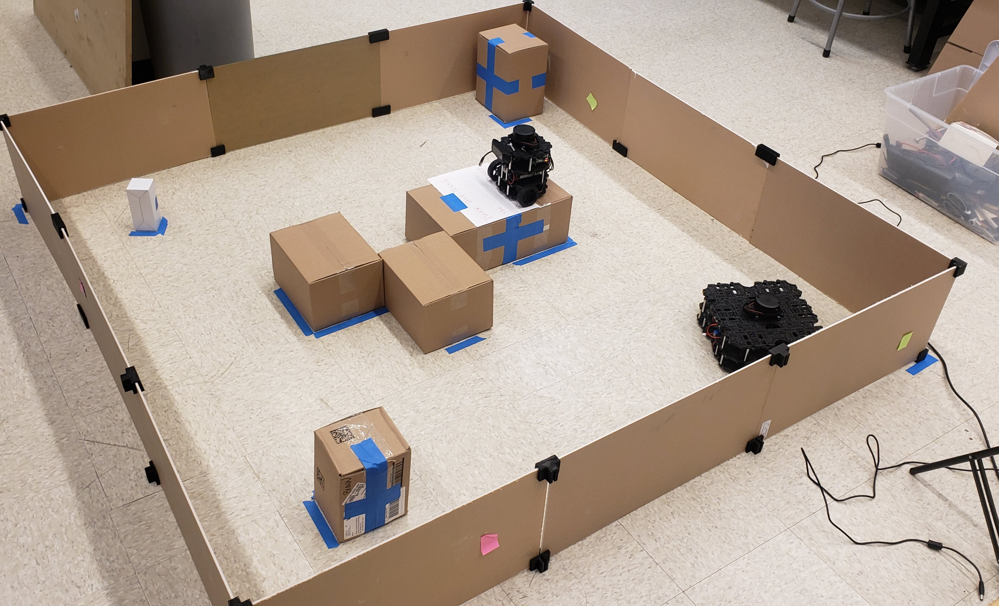

# Turtlebot Teaming 

## Objective 

This project shows how two turtlebots can cooperate with each other to finish a task.

- Turtlebot3 Burger: The Burger bot wants to go to a target destination on a platform. However, it has to pass through a gap to achieve that. As soon as Burger reaches the gap, it request Waffle for help, wait until Waffle sucessfully finishes its task and continues driving to reach its destination.
- Turtlebot3 Waffle: The Waffle bot stays on the ground until it receives a “help” message from Burger. Then, it will navigate to the gap, push the box to fill the gap, and will drive back to its starting position.

## System Requirements

### For Simulation  
- Ubuntu Linux-Focal Fossa(20.04)
- [Gazebo Fortress](https://gazebosim.org/docs)
- [ROS2 galactic](https://docs.ros.org/en/galactic/Installation/Alternatives/Ubuntu-Development-Setup.html)

### For real robots
This project uses a Raspberry Pi 4B, Turtlebot3 Burger, Turtlebot3 Waffle and USB camera. To setup the real bots using Raspberry Pi follow the instructions [here](https://emanual.robotis.com/docs/en/platform/turtlebot3/sbc_setup/#sbc-setup)

## Installation 

### Navigation2 packages
We use Nav2 packages to from localization and mapping.
```
sudo apt install ros-<ros2-distro>-navigation2
sudo apt install ros-<ros2-distro>-nav2-bringup
```

### Turtlebot3 PC Setup Requirements
Here are some essential packages that needs to be installed on your PC.

1.  Install Cartographer
    
        sudo apt install ros-<ros2-distro>-cartographer
        sudo apt install ros-<ros2-distro>-cartographer-ros
2.  Install Navigation
    
        sudo apt install ros-<ros2-distro>-navigation2
        sudo apt install ros-<ros2-distro>-nav2-bringup
3.  Install additional Turtlebot3 packages
    
        sudo apt install ros-<ros2-distro>-dynamixel-sdk
        sudo apt install ros-<ros2-distro>-turtlebot3-msgs
        sudo apt install ros-<ros2-distro>-turtlebot3

### Build your workspace
- Build your own workspace and clone the repository.
- Install the necessary packages and dependencies with following commands
``` cd src/
vcs import < src/RSP_final_project/final_project/RSP_final_project.repos
cd ..
rosdep install --from-paths src --ignore-src -r -y
colcon build
```


# Package Info


## `final_project`

This package contains the main launch files that are used to launch simulation in ignition gazebo  or to control the real robots. The `urdf` folder contains all xacro files used to spawn waffle and burger in ignition gazebo. Note that you will not need these urdfs files for the real robots.  The config files that nav2 uses are located in `param` folder. By default, `waffle.yaml` is used for simulation and `waffle_real.yaml` is used to navigate the real Waffle. `rviz` file has all the rviz configurations used for the simulations and real robots. All map files are stored in `map` folder. If you want to create your own map, we suggest you to store your map files under this folder. 


## `ign_gazebo`

This package contains meshes and models for the Aruco AR markers and entities in the world for ignition gazebo simulation. You can change the world by changing the `bot_world.xacro` in `urdf` file. You can add your own markers by importing the meshes and models into this package.   

## `maze_msgs`

All the source files required to run the actions that enable this team task are located in [this package](https://github.com/Mixmorks/RSP_final_project/tree/main/maze_msgs). This package has an `action` directory that contains the goal, result and feedback information for all the actions used for the project. 


## `navtopose`

The navtopose package can be used to send a target location to waffle. There are two ways to set a goal pose through nav2 - one is to use the Nav2Goal option in Rviz while running the simulation and the second one is to utilize this package to set the goal.

## `turtlebot_actionlib`

The turtblebot_actionlib package contains multiple action servers and clients that execute the actions in `maze_msgs`. It has three nodes: 'maze', 'waffle',and 'burger',and their relationship shown in [action diagram](./docs/action_diagrampng.png). To run the simulation and real robot separately, what you need to do is tuning the parameters in . 


# Simulation
## Mapping 

SLAM toolbox was used to create the map. Follow the instructions in this section to generate a map. 

1.  Run the `simulation_draw_map.launch` file in a new terminal.
    
        ros2 launch final_project simulation_draw_map.launch
    
This launch file will start up rviz and use waffle&rsquo;s lidar data to create a map. It also starts up a teleop node that allows users to drive around in their simualtion world. The map will update periodically in rviz while the waffle is moving.
    
2.  Save the map. Open a brand new terminal and run the map saver command.
    
        ros2 run nav2_map_server map_saver_cli -f <path/to/save/your/map>
    
This command saves map files to a user defined path. For example, if you want to save the map files under you home directory. You can run
    
        ros2 run nav2_map_server map_saver_cli -f ~/map

Note: The map saver command saves two files on your PC. You can visualize your map in &ldquo;map.pgm&rdquo;. The &ldquo;map.yaml&rdquo; file contains some parameters and the path to your &ldquo;map.pgm&rdquo; file. If you want to load your map into rviz, you might want to change your &ldquo;pgm&rdquo; file&rsquo;s path in the &ldquo;yaml&rdquo; file so that rviz can find and load your map correctly. You can `Ctrl+C` to stop the `simulation_draw_map.launch` that is running once you save the map. 

## Visualize the teaming on ignition gazebo and rviz

1.  To launch the simulation with predefined worlds and parameter, you can 
    
        ros2 launch final_project maze_action_simulation.launch

2.  Open a new terminal and run the following command. This command initiates the process of Burger driving, and starts communication between the two bots.
    
        ros2 run turtlebot_actionlib client
        
Map and Waffle in Rviz     |  Bots in Ignition Gazebo
:-------------------------:|:-------------------------:
 |  

The lidar on Waffle scans the world to create a map and localize itself. Whereas Burger scans the Aruco AR markers using its camera to localize itself.  
        
 


3. Burger localization depends on the `ros2_aruco` package. This package locates Aruco AR markers in images and publishes their ids and poses. 
- Node `aruco_node`
- Subscribes to 
    `/camera/image_raw`
    `/camera/camera_info` 
- Publishes 
    `/aruco_poses` 
    `/aruco_markers`
`/aruco_markers` gives the pose of the AR tag relative to the camera link on Burger bot. 

4. #TODO Add nodes, published topics and subscriptions to expect from action files and important nav2 files. 

# On the real bots 

1. ssh into turtlebots. 
2. 
 
#TODO

