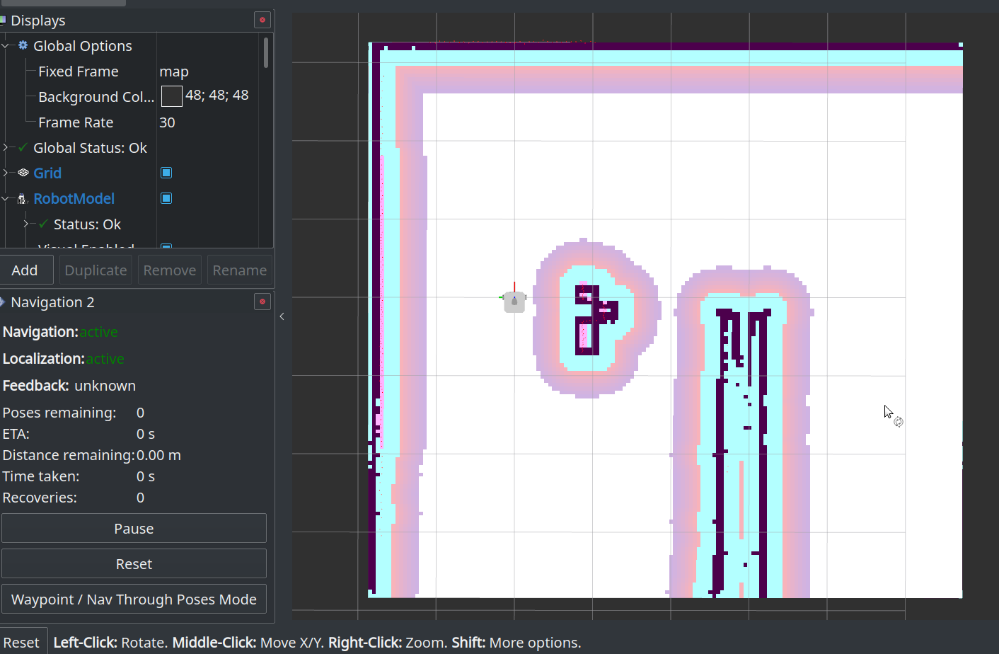

# Table of Contents

1.  [RSP Final Project - Mutlibots Maze](#org3441bcf)
    1.  [Installation](#orgc3425d3)
    2.  [Run the simulation](#org52e9431)
    3.  [Action Server and Client](#orgc4d372d)

# RSP Final Project - Mutlibots Maze

Simple two Turtlebots cooperate by using Nav2 SLAM and navigation,Aruco,and Action server and client methods.

## Installation

1.  Build your own workspace and download the repository

    git clone https://github.com/Mixmorks/RSP_final_project.git

1.  Install the necessary packages and dependencies(include nav2) with following commands
    
        cd src/
        vcs import < src/RSP_final_project/final_project/RSP_final_project.repos
        cd ..
         rosdep install --from-paths src --ignore-src -r -y
        colcon build

## Run the simulation

1.  To launch the simulation with predefined worlds and parameter, you can  Runnymede
    
        ros2 launch final_project maze_action_simulation.launch

2.  Open an new terminal and run
    
        ros2 run turtlebot_actionlib client

## Action Server and Client

You could read the [\`Mazemsgs\` readme](./maze_msgs/README.md) to better understand the action message type and functionality.
To start the Arudo node, you could refer to Aruco chapter.

